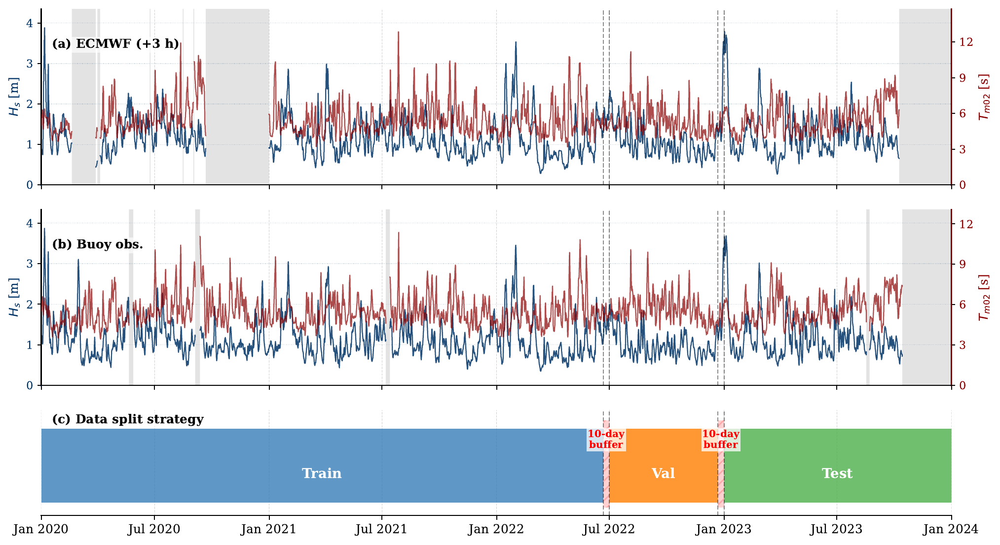
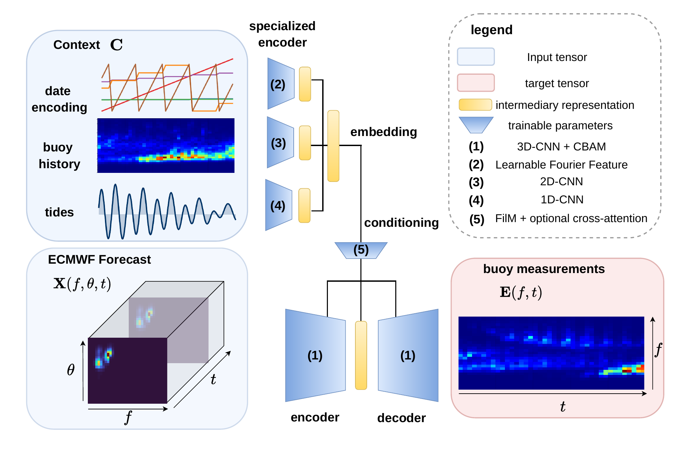

# Site-specific post-processing of spectral wave forecast by learning from buoy measurements

This repository accompanies a manuscript submitted to *JGR: Machine Learning
and Computation*.  It contains the code, configuration files, and retained
diagnostic outputs used to evaluate a site-specific machine-learning
post-processing method for ECMWF spectral wave forecasts on the Australian
North West Shelf.

Operational numerical wave forecasts provide essential information for maritime
operations, but local systematic errors remain.  At the deep-water Browse Basin
study site, the ECMWF forecast can exhibit structured swell errors, including a
premature swell-arrival bias.  This work frames forecast correction as a
supervised learning problem: the model learns from historical ECMWF directional
wave spectra, contextual variables, and local buoy measurements to produce a
buoy-consistent one-dimensional energy spectrum over a five-day forecast
horizon.

## One-minute overview

The dataset links ECMWF forecast issuances, local buoy observations, and
contextual information on a common forecast horizon.  The train, validation, and
test periods are separated chronologically to evaluate the model on future
conditions rather than randomly interleaved neighboring sea states.



The selected model, SpecX, processes the ECMWF directional spectrum with
theta-aware spectral convolutions and context-conditioned encoder-decoder
blocks.  Date and tide information are injected through feature-wise linear
modulation, allowing the network to learn site-specific seasonality and
hydrodynamic modulation while retaining the spectral structure of the forecast.



The retained ensemble improves the low-frequency swell regime, including swell
height and period diagnostics, while the higher-frequency wind-sea regime
remains more stochastic and less consistently corrected.


## Repository contents

```text
docs/            Scientific context, data schema, experiment settings, and
                 figure-reproduction notes.
src/
  architecture/  SpecX model, theta-aware convolutions, FiLM/context encoders,
                 gates, and cross-attention blocks.
  training/      Data collation, epoch runner, losses, metrics, scalers, and
                 optimizer helpers.
  utils/         NetCDF dataset loader, frequency interpolation, scaler tools,
                 and forecast/observation table builders.
  plotting/      Manuscript-style diagnostics, dashboards, boxplots, heatmaps,
                 PCA analysis, QQ plots, and reliability plots.
  scripts/       Training, ensemble training, and hyperparameter-search entry
                 points.
results/         Retained ensemble diagnostics used for reviewer inspection.
```

## Data expectations

The training scripts expect preprocessed NetCDF files with the following layout:

```text
DATA_ROOT/
  ecmwf_forecast_nc/              Forecast files named YYYYMMDD_HH.nc
  buoy_nc/                        Buoy observation files named YYYYMMDD_HH.nc
  <tide_directory>/processed_tides.nc
```

The default pipeline predicts the buoy one-dimensional energy spectrum `E(f)`
from the ECMWF directional spectrum and selected context variables.  The custom
collation logic uses tensor layout `(B, C, T, F, Theta)` after batching.

Additional data details are provided in [docs/data_schema.md](docs/data_schema.md).

## Environment

Install the core Python dependencies with:

```bash
python3 -m pip install -r requirements.txt
```

The original training workflow was developed for GPU/HPC execution.  The Python
modules can nevertheless be inspected and reused locally.  When running outside
the original environment, set:

```bash
export DATA_ROOT=/path/to/processed/data
export OUTPUT_ROOT=/path/to/output
```

## Reproducing the retained experiment

Single SpecX training run:

```bash
python3 -u src/scripts/train.py \
  --model_name specx \
  --model_size base \
  --input_mode spectra \
  --target_mode direct \
  --epochs 25 \
  --batch_size 16
```

Ensemble training and post-training diagnostics:

```bash
python3 -u src/scripts/train_ensemble.py
```

Additional reproduction notes are provided in
[docs/reproduce_figures.md](docs/reproduce_figures.md).

## Reviewer documentation

- [Scientific context](docs/scientific_context.md)
- [Data schema](docs/data_schema.md)
- [Experiment configuration](docs/experiment_config.md)
- [Figure reproduction](docs/reproduce_figures.md)
- [Known limitations](docs/known_limitations.md)
- [Data availability draft](DATA_AVAILABILITY.md)
- [Software availability draft](SOFTWARE_AVAILABILITY.md)
- [Release checklist](PUBLICATION_CHECKLIST.md)

## Availability status

This repository is prepared as a reviewer-facing software snapshot.  The buoy
observations associated with the study are commercially restricted and are not
redistributed here unless explicit permission is obtained.  ECMWF data access
and software archival information should be cited in the manuscript Open
Research section once the public release and DOI are finalized.
